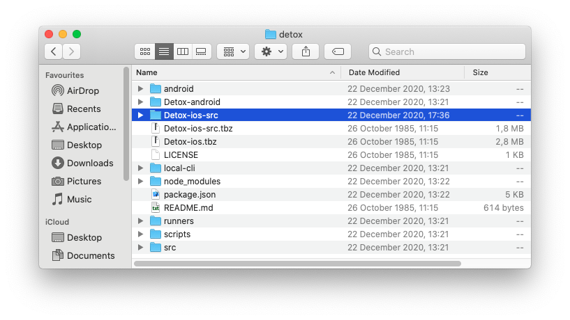
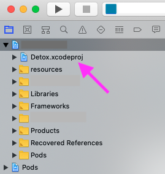
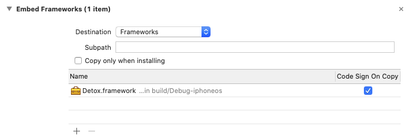

# Debugging in Xcode During Detox Tests

> This is mostly useful for investigating weird crashes or when contributing to Detox itself. **This workflow isn't standard. Don't use it unless you have a good reason.**

### Add Detox Framework to Your Project

1. Go to `node_modules/detox` and extract `Detox-ios-src.tbz`.
<br> 
1. Drag `Detox-ios-src/Detox.xcodeproj` into your Xcode project.
<br> 
1. Go to your project settings -> **General** and add **Detox.framework** to **Frameworks, Libraries, and Embedded Content** (make sure **Embed & Sign** is selected under **Embed**)
<br> 

> NOTE: Apps should not be submitted to the App Store with the Detox framework linked. Follow this guide only to debug Detox issues in your project. Once finished, make sure to remove **Detox.framework** from your project.

### Add 'None' Configuration to Detox Section

Edit the Detox section in `package.json` to add the following configuration:

```json
"ios.none": {
  "binaryPath": "ios",
  "type": "ios.none",
  "device": {
    "type": "iPhone 8 Plus"
  },
  "session": {
    "server": "ws://localhost:8099",
    "sessionId": "<your app's bundle identifier>"
  }
}
```

> NOTE: This configuration will not handle simulator and application lifecycle, they will have to be performed manually (e.g. running your application from Xcode).

### Run Detox Server Manually

Run the following command in your project root directory:

```sh
detox run-server
```

### Run Your Application from Xcode

Run your application from Xcode as you normally do.

> NOTE: Before running, place breakpoints you wish to debug.

### Run Detox Tests

Run the following command in your project root directory:

```sh
detox test --configuration ios.none
```

> NOTE: Tests that call `device.launchApp()` may fail as this API is unavailable when using `ios.none` configuration types. Instead, use `it.only` to run specific tests and restart your app from Xcode.
