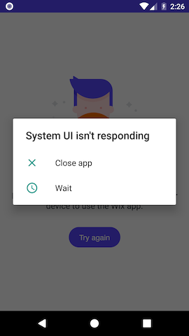
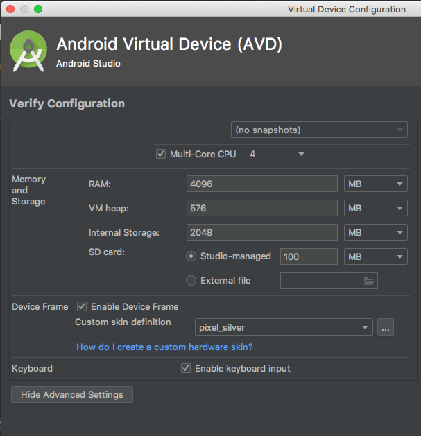
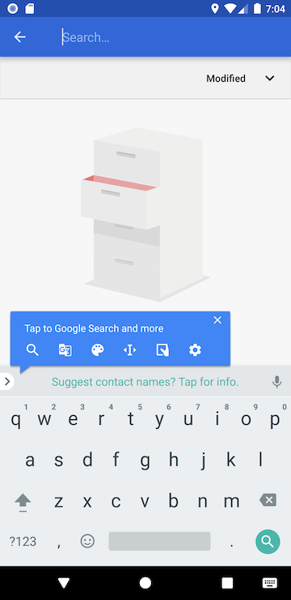

# Setting Up Android Emulators: Best Practices

This page is a walkthrough over important **best practices** we recommend applying in environments meant for running Detox (or even Espresso-native) automated tests using Android emulators.

In particular, this applies to CI machines aimed at running automated end-to-end tests in each build.


## 1. Minimizing ANR's

Sooner or later, all Android developers (and even users) find themselves facing Android's infamous `Application Not Responding` alerts (i.e. ANR's). They come in various flavors, but in tests-running emulators we've most commonly witnessed this specific flavor -- which seemed to appear shortly after emulators finish starting up:



In the world of gray-box end-to-end testing (Detox, Espresso), ANR's are a living nightmare because the view hierarchy isn't available for traversal and thus no view can be found in any of the familiar matching techniques (i.e. test-ID based, label and class). When in-effect, ANR's imminently cause **all** tests to end in failure.

The typical error seen by Detox/Espresso when this happens is this:

```
Waited for the root of the view hierarchy to have window focus and not request layout for 10 seconds. If you specified a non default root matcher, it may be picking a root that never takes focus. Root:

     Root{application-window-token=android.view.ViewRootImpl$W@e9fb720, window-token=android.view.ViewRootImpl$W@e9fb720, has-window-focus=false, layout-params-type=1, layout-params-string=WM.LayoutParams{(0,0)(fillxfill) sim=#110 ty=1 fl=#81810100 pfl=0x20000 wanim=0x10302f6 vsysui=0x500 needsMenuKey=2 colorMode=0}, decor-view-string=DecorView{id=-1, visibility=VISIBLE, width=1080, height=1920, has-focus=false, has-focusable=true, has-window-focus=false, is-clickable=false, is-enabled=true, is-focused=false, is-focusable=false, is-layout-requested=false, is-selected=false, layout-params=WM.LayoutParams{(0,0)(fillxfill) sim=#110 ty=1 fl=#81810100 pfl=0x20000 wanim=0x10302f6 vsysui=0x500 needsMenuKey=2 colorMode=0}, tag=null, root-is-layout-requested=false, has-input-connection=false, x=0.0, y=0.0, child-count=3}}
```

Yikes!


Our recommended course of action in order to minimize these is to increase the resources available for the emulator, as the defaults are outdated. Namely, set **disk size to 4gb**, **RAM to 2gb** (or more, if the system allows it) and **VM's heap to 576mb** (max limit). Here's how to apply it:

#### Using Android Studio (if available)

> Note: this set of instructions is proper with respect to **Android Studio 3.5**

1. Open an Android project in Android Studio
2. Open the AVD manager: *Tools > AVD Manager*
3. Edit the test-target AVD by tapping on the associated _pen_ icon, under the _Actions_ column
4. Tap _Show Advanced Settings_
5. Under _Memory and Storage_, set the associated values in `RAM`, `VM heap` and `Internal Storage`:



#### Editing the emulator's `config.ini`

If Android Studio isn't available on the associated system (typicaly true for CI agents), the resources configuration can be set manually:

1. [Locate the AVD's `config.ini`](#locating-the-avds-home-directory)
2. Using your favorite text editor, either change or add these key-value sets:

```ini
hw.ramSize=4096
vm.heapSize=576
disk.dataPartition.size=2048M
```


> ### *Other Resolutions*
>
> If nevertheless ANR's still persist, there are 2 more recommendations we have up our sleeve:
>
> 1. Read the section below on post-quick-boot high CPU usage bug.
> 2. (for automated CI machines) Consider integrating the detection & dismissal script published in [this stackoverflow discussion](https://stackoverflow.com/questions/52410440/error-system-ui-isnt-responding-while-running-aosp-build-on-emulator/56579873#56579873) in your CI scripts.


## 2. Enable Quick-Booting

If the system allows saving a state (for example, in dev computers or a CI system with custom VM agents with prebaked images you can configure), we highly and strongly recommend setting up quick-boot snapshots for you emulators. Quick-boot saves significant time otherwise wasted when emulators cold-boot from scratch. The concept becomes more prominent in environments capable of parallel-executing tests in multiple, concurrently running emulators (as when [Detox is run with multiple Jest workers](Guide.Jest.md)).

Instructions on how to set this up can be found in numerous sources on the web, mainly [Google's developers guide](https://developer.android.com/studio/run/emulator#snapshots) and [this blogpost](https://devblogs.microsoft.com/xamarin/android-emulator-quick-boot/). However, they all assume a GUI based environment, and this isn't always the case (for example, when the CI is run on lean Linux agents).

Luckily, quick-boot configuration can be set manually:

1. [Locate the AVD's `config.ini`](#locating-the-avds-home-directory)
2. Using your favorite text editor, either change or add these key-value sets:

```ini
fastboot.chosenSnapshotFile=
fastboot.forceChosenSnapshotBoot=no
fastboot.forceColdBoot=no
fastboot.forceFastBoot=yes
```

> Empirically, `forceFastBoot=yes` and `forceColdBoot=no` should be enough.

3. Under the AVD's home directory, either create or edit yet another `ini` file called `quickbootChoice.ini` with the following content:

```ini
saveOnExit = true
```

4. Now that everything is in place, [launch your emulator](#booting-an-emulator-via-command-line) once (in verbose mode) and wait for it to fully load. Then, shut it down, and make sure the [state has been saved](#verifying-the-emulators-quick-boot-snapshot-has-been-saved). 

## 3. Fixing Post-Quickboot High CPU Load Bug

If you have configured your emulators to quick-boot instead of cold-boot (as we have -- and as previously recommended here), you might have overlooked a bug where right after boot completion, the emulator runs at very high CPU usage and virtually chokes it altogether. We've detected this bug in both Mac and Linux machines, where the emulator binary installed was of version `29.0.11`: the CPU started and stayed at high load for 1-2 minutes and then went down with no manual intervention.

How to detect that:

1. Run the AVD that's been properly set up with quick-boot.
2. Log into it using an `adb shell` command.
3. Run the `top` command inside the shell.

If your emulator has this issue, the auto-refreshing `top` would generate a chart-output that looks something like this:

```
 1679 root         20   0 7.7M 4.1M 3.6M S  0.0   0.2   0:00.04 hostapd /vendor/etc/simulated_hostapd.conf
Tasks: 170 total,   1 running, 168 sleeping,   0 stopped,   1 zombie
Mem:   1548592k total,  1169576k used,   379016k free,     8904k buffers
Swap:        0k total,        0k used,        0k free,   654480k cached
400%cpu  55%user 147%nice 109%sys  89%idle   0%iow   0%irq   0%sirq   0%host
  PID USER         PR  NI VIRT  RES  SHR S[%CPU] %MEM     TIME+ ARGS
 2226 u0_a13       20   0 1.6G 173M 132M S  170  11.4   0:20.45 com.google.android.gms
 2115 u0_a13       20   0 1.4G 166M 125M S  157  10.9   0:29.93 com.google.android.gms.persistent
 1690 system       18  -2 1.4G 166M 132M S 38.0  10.9   0:28.62 system_server
  551 root         20   0    0    0    0 S  1.6   0.0   0:00.26 [kswapd0]
 5660 shell        20   0 7.3M 3.4M 2.8M R  0.6   0.2   0:00.07 top
```

Namely, it will show that the [Google Mobile Services (GMS)](https://www.android.com/gms/) performs background work at high load: `com.google.android.gms` at `170%` and`com.google.android.gms.persistent` at `157%` (4 CPU cores in this example).

This state makes it impossible for end-to-end tests to run properly, as they are typically resources consuming by themselves.

In essence, there are 2 approaches we can recommend in order to tackle this:

1. Upgrade the emulator's version! In Detox' own CI, **upgrading to `29.2.1` fixed the issue**. Note that after doing so, you will have to recreate the quick-boot snapshot, as the existing one will no longer be supported.
2. Recreate an AVD with no google API's installed (e.g by passing in `-k "system-images;android-26;default;x86_64"` instead of `-k "system-images;android-26;google_apis;x86_64"` when creating the AVD using the [`avdmanager create avd`](https://developer.android.com/studio/command-line/avdmanager) command).

> Unfortunately, we can't account for the full validity of option #2, as we haven't tried it ourselves, and it seems it would introduce some shortcomings (you _do_ need Google's API's for some things). **We only offer it here as a suggestion.**

To check and update your tools' versions, use the [sdk-manager tool](https://developer.android.com/studio/command-line/sdkmanager).


## 4. Google's keyboard onboarding

Google AVD images, as with Google devices (e.g. Pixels), are shipped with [Google's gboard](https://play.google.com/store/apps/details?id=com.google.android.inputmethod.latin) as the default keyboard. Gboard is feature-rich: sporting type-suggestions, swipe-based typing, themes and more. Great for users, not so great for automation testing.

One feature that can literally break tests is the onboarding dialog box (titled `Tap to Google Search and more`):



When it appears, it can either hide the text-input currently in focus, or even interfere with the injection of typing events generated by the test instrumentation (i.e. Espresso's internals) -- resulting in invalid content inside text-input views.

Luckily, like all onboarding experiences, this box only shows conditionally. That means that if it's been giving you a hard time -- it's possible to get rid of it. Here's how.

#### The naive (and easy) solution

If you have GUI and you're running on a machine that can save the emulator's state, follow these steps:

1. [Launch the testing-target emulator](#booting-an-emulator-via-command-line) from scratch in verbose mode.
2. Run the Files app; Inside it, tap on the search icon (magnifying glass): the dialog will appear.
3. Simply dismiss the dialog box once, close all running apps and shut the emulator down; [make sure the emulator's state has been saved](#verifying-the-emulators-quick-boot-snapshot-has-been-saved). If so, you'll be safe for some time (not sure how long - that's what makes this a bit naive rather than bulletproof).

Alternatively, or simply if there's no GUI, you can simply launch this command right after the emulator finishes launching:

```
adb shell am force-stop com.google.android.inputmethod.latin
```

The keyboard will shut down and save it's shared-preferences state such that the onboarding dialog box will not show for some time. After this, yet again, shut the emulator down.

#### Robust (hard) solution

A deeper look shows the keyboard "app" saves it's settings on an Android device in this xml file:

```
/data/data/com.google.android.inputmethod.latin/shared_prefs/com.google.android.inputmethod.latin_preferences.xml
```

In particular, these two key-value entries control the appearance of the onboarding box:

```xml
    <int name="pref_key_access_points_hint_shown_times" value="1" />
    <long name="pref_key_access_points_hint_shown_timestamp" value="1575448422872" />
```

Hence, changing the timestamp to a futuristic value will make sure you won't ever see the dialog box again. Unfortunately, that's a bit tricky to pull off - yet doable:

1. [Launch the testing-target emulator](#booting-an-emulator-via-command-line) from scratch in verbose mode.
2. Log-in as a [superuser](#logging-in-to-an-emulator-as-a-superuser-(root)).
3. Kill the gboard "app":

```
am force-stop com.google.android.inputmethod.latin
```

4. Copy the `xml` to `/sdcard`:

```
cp /data/data/com.google.android.inputmethod.latin/shared_prefs/com.google.android.inputmethod.latin_preferences.xml /sdcard/
```

5. In your computer's shell, pull the file back to it:

```
adb pull /sdcard/com.google.android.inputmethod.latin_preferences.xml
```

6. Edit the file on your computer. Set `pref_key_access_points_hint_shown_times` to 1 and `pref_key_access_points_hint_shown_timestamp` to `1893456000000` (i.e. 1/1/2030):

```xml
    <int name="pref_key_access_points_hint_shown_times" value="1" />
    <long name="pref_key_access_points_hint_shown_timestamp" value="1893456000000" />
```

7. Push the file back to the emulator:

```
adb push com.google.android.inputmethod.latin_preferences.xml /sdcard
```

8. Back to the emulator's shell (as a **root**): copy the file back from `/sdcard`:

```
cp /sdcard/com.google.android.inputmethod.latin_preferences.xml /data/data/com.google.android.inputmethod.latin/shared_prefs/
```

9. Shut the emulator down and [make sure the emulator's state has been saved](#verifying-the-emulators-quick-boot-snapshot-has-been-saved).

#### Ultra-robust solution (= best)

In the interest of full disclosure, **we've stopped seeing the onboarding dialog box in emulator images starting SDK 28**. So if you're dealing with this issue, seriously consider upgrading your AVD.

Alternatively, and again - if possible, consider switching to an emulator with no Google API's installed -- as explained in the section on dealing with the high CPU-load bug.

## Annex

### Locating the AVD's home directory

Each AVD generated by the Android tools gets it's own directory where associated content is stored:

* **Configuration file (i.e. `config.ini`)**
* Snapshot images
* SD-card content

to name a few.

On Mac machines, the AVD directory typically maps to:

```
$HOME/.android/avd/<AVD Name>.avd/
```

_(for example: `/Users/root/.android/avd/Pixel_API_26.avd/`)_

The path should be similar on Linux machines, even though `$HOME` isn't `/Users/root` but typically `/home/root` *(for example: `/home/root/.android/avd/Pixel_API_26.avd/`).*


On Windows, the typical path is:

```
<ANDROID_SDK_HOME>\.android\avd\<AVD Name>\
```

*(for example: `C:\Android\.android\avd\Pixel_API_26.avd\`)*


### Booting an emulator via command-line

> The following examples apply for both Mac and Linux, and should be similar on Windows.

**Shortcut for booting a verbose, visible emulator in a GUI supporting system**

```
> $ANDROID_HOME/emulator/emulator -verbose @Pixel_API_26 &
```

**Shortcut for booting a verbose, _headless_ emulator in a UI-less Linux system**

```
> $ANDROID_HOME/emulator/emulator -verbose -no-window -no-audio -gpu swiftshader_indirect @Pixel_API_26 &
```


### Verifying the emulator's quick-boot snapshot has been saved

If you've run your emulator in verbose mode from a shell, it's easy to verify the state has been saved by following the logs. In particular, when shutting the emulator down, this log asserts the state has been saved:

```
emulator: Saving state on exit with session uptime 9423 ms
```

> as a reference, when the state is _not_ saved, the typical output is:
>
> ```
> emulator: WARNING: Not saving state: RAM not mapped as shared
> ```
>
> It can be a result of an improper configuration, or an emulator launch where the `-read-only` argument was provided.


### Logging in to an emulator as a superuser (root)

> Based on this [Stackoverflow answer](https://stackoverflow.com/a/40097307/453052)

1. (Re)start the adb server in root mode:

```
adb root
```

2. Launch an emulator (no need to re-launch)

3. Log-in as a superuser

```
adb shell
su
```

*Note: `su` isn't necessary in all environments*